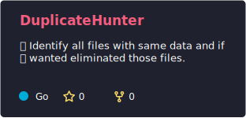

### Hi there 👋

Apologies for the mess. I'm still in the process of organizing things here.

 
  
<h2>🔥 Main Projects</h2>

  

    
  

 
  
<h2>❄️🔨 Cool Tools</h2>

  

    
  

  

<!--
**Isotton1/Isotton1** is a ✨ _special_ ✨ repository because its `README.md` (this file) appears on your GitHub profile.

Here are some ideas to get you started:

- 🔭 I’m currently working on ...
- 🌱 I’m currently learning ...
- 👯 I’m looking to collaborate on ...
- 🤔 I’m looking for help with ...
- 💬 Ask me about ...
- 📫 How to reach me: ...
- 😄 Pronouns: ...
- ⚡ Fun fact: ...
-->
